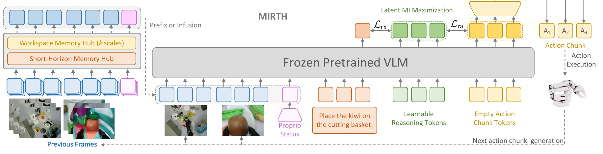
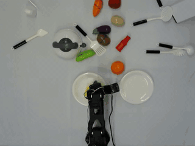
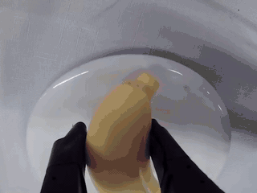
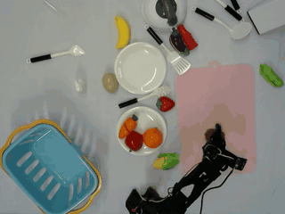
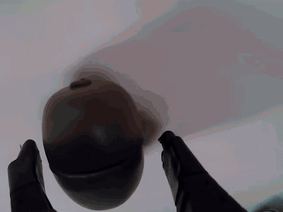
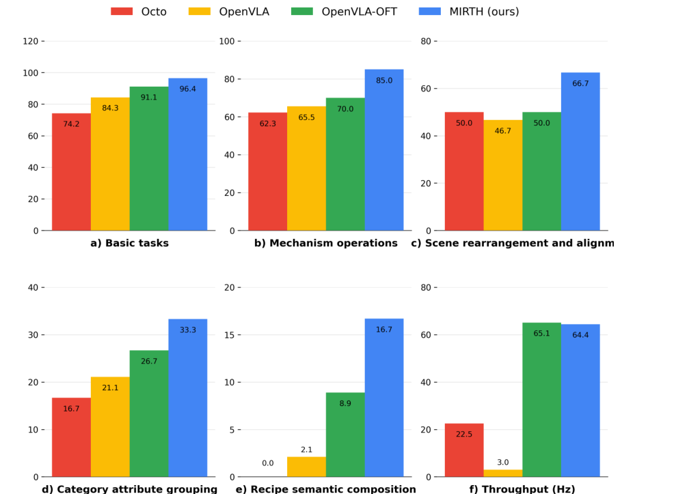

<div align="center">

# MIRTH

### Mutual-Information Reasoning with Temporal Hubs for Vision-Language-Action Agents

[](https://aclanthology.org/2026.acl-long.1016/)
[](https://aclanthology.org/2026.acl-long.1016/)
[](https://aclanthology.org/2026.acl-long.1016.pdf)
[](https://arxiv.org/abs/2606.31167)
[](https://github.com/kiva12138/MIRTH)

Hao Sun, Yu Song, Shiyu Teng, Ziwei Niu, Yen-Wei Chen

**ACL 2026 Long Papers**

</div>

MIRTH is a Vision-Language-Action (VLA) framework for history-aware robot control. It augments a pretrained OpenVLA-style backbone with temporal memory hubs, mutual-information-guided latent reasoning tokens, and parallel action decoding to address temporal myopia, reasoning gaps, and autoregressive control latency.

## News

>  We released [**Pi-SimplerVersion**](https://github.com/kiva12138/Pi-SimplerVersion)!: A pure PyTorch implementation of Pi0 and Pi0.5 for researchers, without TensorFlow, JAX, or other heavy framework dependencies.

>  We released [**RLDS_DataLoader**](https://github.com/kiva12138/RLDS_DataLoader)!: A lightweight RLDS dataloader that avoids TensorFlow, dlimp, and version-lock issues, making RLDS-style data easier to use.

>  The datasets are released on **Huggingface**!: Both [**RLDS**](https://huggingface.co/datasets/Kiva12138/mirth_rlds) and [**LeRobot**](https://huggingface.co/datasets/Kiva12138/mirth_lerobot) dataset formats are provided through Huggingface.

>  [**Personal website**](https://kiva12138.github.io)!: Hao Sun's personal website. If you are interested for collabration, refer to this.

> Paper note: the [ACL accepted PDF](https://aclanthology.org/2026.acl-long.1016.pdf) contains some formula-symbol errors. Please refer to the [arXiv version](https://arxiv.org/abs/2606.31167) for the corrected notation. The ACL Anthology page remains the official citation record.

---

## Highlights

- **Temporal memory hubs**: dual-scale workspace and short-horizon hubs compress long-term scene evolution and recent motion dynamics into compact prompts.
- **Latent reasoning tokens**: learnable reasoning tokens are aligned with both multimodal context and action trajectories through a mutual-information objective.
- **Parallel action decoding**: vector-wise action prediction replaces scalar-wise autoregressive decoding for higher control throughput.
- **MIRTH dataset**: a multi-camera real-world manipulation dataset collected on a physical LeRobot platform, covering basic manipulation, mechanism operation, scene rearrangement, category reasoning, and semantic recipe tasks.
- **Simulation and real-world validation**: MIRTH is evaluated on LIBERO simulation suites and a physical LeRobot platform with multi-camera observations.

## Method overview

MIRTH keeps the pretrained VLA backbone largely frozen and adds lightweight trainable modules around it:

<p align="center">
  
</p>

<p align="center"><em>Figure 1: Overall MIRTH architecture. Temporal memory hubs summarize historical context, latent reasoning tokens bridge multimodal observations and action trajectories, and parallel action decoding predicts the next action chunk efficiently.</em></p>

<table align="center">
  <tr>
    <th>Component</th>
    <th>Role</th>
  </tr>
  <tr>
    <td>Workspace memory hub</td>
    <td>Maintains multi-scale exponential moving averages of historical visual/proprioceptive features for long-horizon context.</td>
  </tr>
  <tr>
    <td>Short-horizon memory hub</td>
    <td>Attends over the most recent frames to capture motion trends and high-frequency local changes.</td>
  </tr>
  <tr>
    <td>Latent reasoning tokens</td>
    <td>Create a compact planning bridge between observations, language instructions, and action trajectories.</td>
  </tr>
  <tr>
    <td>Parallel action head</td>
    <td>Predicts action chunks in a single forward pass instead of generating action dimensions autoregressively.</td>
  </tr>
</table>

## Dataset overview

Beyond the model architecture, MIRTH introduces the MIRTH dataset, a real-world LeRobot manipulation dataset collected with synchronized main-camera and wrist-camera observations. The MIRTH dataset is organized into five levels of increasing semantic and control complexity. Each level contains four different tasks, and each task contains 50 expert demonstration episodes, yielding **1000** episodes in total. Demonstrations are collected under randomized object poses and workspace configurations to support robust imitation learning and evaluation.

For dataset download links and format notes, please refer to [2. Downloads](#2-downloads).

<table align="center">
  <tr>
    <th>Level</th>
    <th>Focus</th>
    <th>Tasks</th>
    <th>Episodes per task</th>
    <th>Episodes</th>
  </tr>
  <tr>
    <td>Basic manipulation</td>
    <td>Atomic pick-and-place and target placement skills.</td>
    <td align="right">4</td>
    <td align="right">50</td>
    <td align="right">200</td>
  </tr>
  <tr>
    <td>Mechanism operation</td>
    <td>Drawer opening / closing and object insertion with articulated mechanisms.</td>
    <td align="right">4</td>
    <td align="right">50</td>
    <td align="right">200</td>
  </tr>
  <tr>
    <td>Scene rearrangement</td>
    <td>Multi-object workspace organization and spatial rearrangement.</td>
    <td align="right">4</td>
    <td align="right">50</td>
    <td align="right">200</td>
  </tr>
  <tr>
    <td>Category reasoning</td>
    <td>Object grouping by category, color, attribute, or exclusion constraints.</td>
    <td align="right">4</td>
    <td align="right">50</td>
    <td align="right">200</td>
  </tr>
  <tr>
    <td>Recipe-level semantic composition</td>
    <td>Long-horizon semantic tasks requiring high-level instruction grounding.</td>
    <td align="right">4</td>
    <td align="right">50</td>
    <td align="right">200</td>
  </tr>
  <tr>
    <td><strong>Total</strong></td>
    <td></td>
    <td align="right"><strong>20</strong></td>
    <td></td>
    <td align="right"><strong>1000</strong></td>
  </tr>
</table>

<table align="center">
  <tr>
    <td align="center"><strong>Sample 1: main camera</strong></td>
    <td align="center"><strong>Sample 1: wrist camera</strong></td>
    <td align="center"><strong>Sample 2: main camera</strong></td>
    <td align="center"><strong>Sample 2: wrist camera</strong></td>
  </tr>
  <tr>
    <td><a href="assets/m1.mp4"></a></td>
    <td><a href="assets/w1.mp4"></a></td>
    <td><a href="assets/m2.mp4"></a></td>
    <td><a href="assets/w2.mp4"></a></td>
  </tr>
</table>

## Results at a glance

LIBERO success rates are averaged over 500 episodes with different seeds, following the paper evaluation protocol.

<table align="center">
  <tr>
    <th>Method</th>
    <th>Spatial</th>
    <th>Object</th>
    <th>Goal</th>
    <th>Long</th>
    <th>Average</th>
  </tr>
  <tr>
    <td>Diffusion Policy</td>
    <td align="right">78.3 +/- 1.1%</td>
    <td align="right">92.5 +/- 0.7%</td>
    <td align="right">68.3 +/- 1.2%</td>
    <td align="right">50.5 +/- 1.3%</td>
    <td align="right">72.4%</td>
  </tr>
  <tr>
    <td>Octo</td>
    <td align="right">78.9 +/- 1.0%</td>
    <td align="right">85.7 +/- 0.9%</td>
    <td align="right">84.6 +/- 0.9%</td>
    <td align="right">51.1 +/- 1.3%</td>
    <td align="right">75.1%</td>
  </tr>
  <tr>
    <td>OpenVLA</td>
    <td align="right">84.7 +/- 1.4%</td>
    <td align="right">88.4 +/- 0.8%</td>
    <td align="right">79.2 +/- 1.1%</td>
    <td align="right">53.7 +/- 0.7%</td>
    <td align="right">76.5%</td>
  </tr>
  <tr>
    <td>OpenVLA-OFT</td>
    <td align="right">97.6 +/- 0.7%</td>
    <td align="right">98.4 +/- 0.4%</td>
    <td align="right">97.9 +/- 0.8%</td>
    <td align="right">94.5 +/- 0.9%</td>
    <td align="right">97.1%</td>
  </tr>
  <tr>
    <td><strong>MIRTH (ours)</strong></td>
    <td align="right"><strong>98.2 +/- 0.6%</strong></td>
    <td align="right"><strong>100.0 +/- 0.4%</strong></td>
    <td align="right"><strong>98.8 +/- 0.5%</strong></td>
    <td align="right"><strong>95.3 +/- 1.1%</strong></td>
    <td align="right"><strong>98.1%</strong></td>
  </tr>
</table>

<p align="center">
  
</p>

<p align="center"><em>Figure 2: Real-world LeRobot evaluation. MIRTH improves success rates across manipulation, mechanism operation, scene rearrangement, category reasoning, and recipe-level semantic tasks while maintaining high control throughput.</em></p>

Additional analysis in the paper shows that MIRTH improves temporal grounding on LIBERO-Long, reduces normalized proprioception probing error compared with OpenVLA, and raises LeRobot failure recovery from 5.2% with single-frame OpenVLA to 12.1% with the full MIRTH model.

## Repository contents

<table align="center">
  <tr>
    <th>Path</th>
    <th>Purpose</th>
  </tr>
  <tr>
    <td><a href="config/">config/</a></td>
    <td>Robot-platform constants and configuration helpers.</td>
  </tr>
  <tr>
    <td><a href="models/">models/</a></td>
    <td>MIRTH model, VLA backbone wrappers, temporal memory hubs, reasoning tokens, and action heads.</td>
  </tr>
  <tr>
    <td><a href="rlds_datasets/">rlds_datasets/</a></td>
    <td>RLDS / TFDS-style data loading.</td>
  </tr>
  <tr>
    <td><a href="lerobot_datasets/">lerobot_datasets/</a></td>
    <td>LeRobot-format data loading and conversion support.</td>
  </tr>
  <tr>
    <td><a href="evaluation/">evaluation/</a></td>
    <td>Action sampling and LIBERO evaluation utilities.</td>
  </tr>
  <tr>
    <td><a href="utils/">utils/</a></td>
    <td>Shared training, data, metric, and checkpoint utilities.</td>
  </tr>
  <tr>
    <td><a href="finetune_ddp.py">finetune_ddp.py</a></td>
    <td>Multi-GPU fine-tuning entry point.</td>
  </tr>
  <tr>
    <td><a href="eval_libero.py">eval_libero.py</a></td>
    <td>LIBERO rollout evaluation script.</td>
  </tr>
  <tr>
    <td><a href="lerobot_to_rlds.py">lerobot_to_rlds.py</a></td>
    <td>Converter for exporting local LeRobot episodes into an RLDS-compatible dataset layout.</td>
  </tr>
  <tr>
    <td><a href=".">Test*.py</a></td>
    <td>Smoke-test scripts for model components, datasets, and environment setup.</td>
  </tr>
</table>

---

## 1. Installation

This project is built upon OpenVLA, but we use a relatively new toolchain (PyTorch 2.9 + CUDA 13) for better extendability with future VLA / VLM stacks. Older environments may also work, but require more configurations.

### 1.1 Create a fresh environment

```bash
conda create -n mirth python=3.13 -y
conda activate mirth
```

### 1.2 Install requirements

```bash
pip install -r requirements.txt
pip install --no-deps "dlimp @ https://codeload.github.com/moojink/dlimp_openvla/zip/refs/heads/main#sha256=e3140251551630c58fe935ef553bdad7e856bb028e8721155d00da714045f665"
```

The pinned versions in [requirements.txt](requirements.txt) include `torch==2.9.1+cu130`, `torchvision==0.24.1+cu130`, `transformers==4.57.3`, `tensorflow==2.20.0`, `tensorflow-datasets==4.9.9`, and `peft==0.18.0`. The file includes the PyTorch CUDA 13.0 wheel index. Make sure your CUDA driver supports CUDA 13. If you must stay on an older CUDA, install the matching `torch` / `torchvision` wheels first, then run the rest of `requirements.txt`.

`dlimp` is installed separately with `--no-deps` because its package metadata pins `tensorflow==2.15.0`, which is not available for Python 3.13. MIRTH uses the TensorFlow 2.20 stack pinned above.

LIBERO is installed as an editable git package from `requirements.txt`. If the editable install fails on your machine, install it manually:

```bash
git clone https://github.com/Lifelong-Robot-Learning/LIBERO.git
pip install -e LIBERO
```

### 1.3 Install Flash Attention (recommended)

We strongly recommend installing [`flash-attn`](https://github.com/Dao-AILab/flash-attention) because training is significantly faster and memory consumption is much lower:

```bash
pip install flash_attn==2.8.3 --no-build-isolation
```

If the prebuilt wheel is unavailable for your platform, pip will try to build `flash-attn` from source. This requires a full CUDA Toolkit installation, not just the PyTorch CUDA wheel. Before building, `nvcc --version` must work and `CUDA_HOME` / `CUDA_PATH` must point to the CUDA install root. On Windows, source builds are especially fragile; if you do not already have a working CUDA compiler toolchain, use the SDPA fallback below.

**If you cannot install `flash_attn`**, you need to fall back to PyTorch's SDPA / math kernels:

1. In [models/vla_model.py:90](models/vla_model.py#L90), change `use_flash_attention_2=True` to `use_flash_attention_2=False`. This makes [models/llm_llama2.py:72](models/llm_llama2.py#L72) and [models/llm_llama2.py:77](models/llm_llama2.py#L77) use `attn_implementation="sdpa"` instead.
2. In [finetune_ddp.py:37-40](finetune_ddp.py#L37-L40), uncomment the four `torch.backends.cuda.enable_*_sdp(...)` lines so that the math-based SDP kernel is enabled as a fallback:

   ```python
   torch.backends.cuda.enable_mem_efficient_sdp(False)
   torch.backends.cuda.enable_cudnn_sdp(True)
   torch.backends.cuda.enable_flash_sdp(True)
   torch.backends.cuda.enable_math_sdp(True)
   ```

Note that the non-flash path is **noticeably slower (about 0.3x)** and uses more GPU memory; we recommend resolving the `flash_attn` build (e.g. by upgrading PyTorch / CUDA) rather than running without it.

---

## 2. Downloads

### 2.1 Foundation model

MIRTH is built on top of OpenVLA, so you must first download the pretrained OpenVLA-7B (Prismatic) foundation model from [openvla/openvla-7b-prismatic](https://huggingface.co/openvla/openvla-7b-prismatic). After downloading, set `pretrained_vla_path` / `PRETRAINED_VLA_PATH` to the local `.pt` checkpoint path in all `Test*.py`, `finetune_ddp.py`, and `eval_libero.py`..

### 2.2 Training data

For LIBERO simulation training, download the modified LIBERO RLDS data from [openvla/modified_libero_rlds](https://huggingface.co/datasets/openvla/modified_libero_rlds).

We provide the MIRTH dataset through Baidu Disk and Google Drive. The two links contain the same files:

- Huggingface: [https://huggingface.co/datasets/Kiva12138/mirth_lerobot](https://huggingface.co/datasets/Kiva12138/mirth_lerobot) and [https://huggingface.co/datasets/Kiva12138/mirth_rlds](https://huggingface.co/datasets/Kiva12138/mirth_rlds)
- Baidu Disk: [https://pan.baidu.com/s/1d8RFeruwF5124L2t4BFUkg?pwd=7890](https://pan.baidu.com/s/1d8RFeruwF5124L2t4BFUkg?pwd=7890), code: `7890`
- Google Drive: [https://drive.google.com/drive/folders/12B_y0w7uoEtVVO91aHMqPuNtV2fbYXGs?usp=drive_link](https://drive.google.com/drive/folders/12B_y0w7uoEtVVO91aHMqPuNtV2fbYXGs?usp=drive_link)

MIRTH dataset supports two dataset formats:

<table align="center">
  <tr>
    <th>Format</th>
    <th>Loader</th>
    <th>Recommendation</th>
  </tr>
  <tr>
    <td>RLDS / TFDS format</td>
    <td><code>rlds_datasets.RLDSDataset</code></td>
    <td><strong>Recommended.</strong> Use this format for training and evaluation whenever possible.</td>
  </tr>
  <tr>
    <td>LeRobot format</td>
    <td><code>lerobot_datasets.LeRobotOpenVLADataset</code></td>
    <td>Provided for compatibility, but the LeRobot dataloader is not guaranteed to be reliable.</td>
  </tr>
</table>

Both formats are included in the MIRTH dataset release. The release also includes the LeRobot calibration file at `calibration/black.json`. Both loaders adapt samples to the same OpenVLA-style batch contract before collation, so they can share `PaddedCollatorForActionPrediction`.

---

## 3. Smoke-test the environment

Before launching a multi-GPU fine-tune, run the `Test*.py` scripts in the repository root to verify that each major component loads correctly on your machine. They are small, self-contained, and surface most installation issues (missing CUDA libs, broken `flash_attn`, wrong `transformers` version, bad HF token, missing RLDS data, etc.) much faster than a full training run.

Before running these scripts, edit their path variables so they point to your real downloaded files and dataset roots, including the OpenVLA checkpoint path, Hugging Face token file, and RLDS / LeRobot dataset directories.

Run them one by one:

<table align="center">
  <tr>
    <th>Script</th>
    <th>What it checks</th>
  </tr>
  <tr>
    <td><a href="TestVisionEncoders.py">TestVisionEncoders.py</a></td>
    <td>Loads the Prism DINO + SigLIP vision backbone and the <code>InfusedDinoSigLIPViTBackbone</code> wrapper, runs a dummy forward pass on the GPU.</td>
  </tr>
  <tr>
    <td><a href="TestLLM.py">TestLLM.py</a></td>
    <td>Loads the pretrained LLaMA-2 backbone via Hugging Face, runs a forward pass on a templated prompt. <strong>Edit <code>hf_token</code></strong> at the top of the file before running.</td>
  </tr>
  <tr>
    <td><a href="TestMemoryHub.py">TestMemoryHub.py</a></td>
    <td>Builds <code>VisionMemoryHubForTraining</code> / <code>ProprioMemoryHubForTraining</code> with synthetic inputs end-to-end through the infused vision encoder.</td>
  </tr>
  <tr>
    <td><a href="TestVLA.py">TestVLA.py</a></td>
    <td>Instantiates the full <code>MIRTH</code> model with a synthetic batch; this is the closest single-process proxy for what <code>finetune_ddp.py</code> does.</td>
  </tr>
  <tr>
    <td><a href="TestDataset.py">TestDataset.py</a></td>
    <td>Builds an <code>RLDSDataset</code> + <code>PaddedCollatorForActionPrediction</code> and iterates a few batches. <strong>Edit <code>DATA_ROOT_DIR</code>, <code>DATASET_NAME</code>, <code>HF_TOKEN</code></strong> at the top of the file.</td>
  </tr>
</table>

Typical invocation:

```bash
python TestVisionEncoders.py
python TestLLM.py
python TestMemoryHub.py
python TestVLA.py
python TestDataset.py
```

If all five pass, your environment is ready for fine-tuning.

---

## 4. Fine-tuning

### 4.1 Configure paths and hyperparameters

All training options live in the `RunConfig` dataclass at the top of [finetune_ddp.py](finetune_ddp.py). Before launching, edit at least the following fields to match your environment:

<table align="center">
  <tr>
    <th>Field</th>
    <th>Meaning</th>
  </tr>
  <tr>
    <td><code>pretrained_vla_path</code></td>
    <td>Path to the pretrained OpenVLA-7B (Prismatic) checkpoint <code>.pt</code> file downloaded from <a href="https://huggingface.co/openvla/openvla-7b-prismatic">openvla/openvla-7b-prismatic</a>.</td>
  </tr>
  <tr>
    <td><code>hf_token</code></td>
    <td>Path to a file containing your Hugging Face access token.</td>
  </tr>
  <tr>
    <td><code>data_root_dir</code></td>
    <td>Directory containing the training datasets; use the RLDS / TFDS root for <code>RLDSDataset</code>, or the LeRobot root for <code>LeRobotOpenVLADataset</code>.</td>
  </tr>
  <tr>
    <td><code>run_dir</code></td>
    <td>Where logs and checkpoints will be written.</td>
  </tr>
  <tr>
    <td><code>dataset_name</code></td>
    <td>RLDS mixture name, e.g. <code>libero_goal_no_noops</code>, <code>libero_object_no_noops</code>, <code>libero_spatial_no_noops</code>, <code>libero_10_no_noops</code>.</td>
  </tr>
  <tr>
    <td><code>run_id</code></td>
    <td>A unique identifier for this run, used as the checkpoint subdirectory.</td>
  </tr>
</table>

Other commonly tuned fields:

- **Memory hub**: `use_vision_memory_hub`, `use_proprio_memory_hub`, `use_action_memory_hub`, `long_memory_scale_number`, `short_memory_length`, and the `tau / beta_min / beta_max / gamma / lmbd / bias` weighting parameters.
- **Reason tokens**: `use_reason_token`, `num_reason_token`, `reason_hidden`, `reason_p_drop`, `reason_out_scale`.
- **Contrastive loss** (optional): `use_contrastive_loss`, `contrastive_tau_ra`, `contrastive_tau_rx`, `lambda_contrastive_ra`, `lambda_contrastive_rx`.
- **Training schedule**: `global_batch_size`, `per_device_batch_size`, `learning_rate`, `epochs`, `max_steps`, `save_freq`, `lr_scheduler_type`, `warmup_ratio`.
- **LoRA**: `use_lora`, `lora_rank`, `lora_dropout`.
- **Stage**: `stage` controls which backbones are frozen (`lvp` = freeze LLM + vision + projector backbones, `lv` = freeze LLM + vision).

### 4.2 Launch DDP training

A typical 3-GPU launch (matching the comment at the top of [finetune_ddp.py](finetune_ddp.py#L1-L4)):

```bash
echo 1 | sudo tee /proc/sys/vm/drop_caches
NCCL_P2P_LEVEL=NVL OMP_NUM_THREADS=1 \
    torchrun --standalone --nnodes 1 --nproc-per-node 3 finetune_ddp.py
```

Adjust `--nproc-per-node` to match the number of GPUs on your machine, and make sure `global_batch_size` is divisible by `per_device_batch_size * num_gpus`.

Checkpoints are saved every `save_freq` steps under `<run_dir>/<run_id>/checkpoints/` as `step-XXXXXX-epoch-XX-loss=YYYY.pt`, plus a `latest-checkpoint.pt` symlink-style copy. To resume, set `resume=True`.

---

## 5. Evaluation on LIBERO

After fine-tuning, evaluate your checkpoint with [eval_libero.py](eval_libero.py).

### 5.1 Configure evaluation

`EvalConfig` (top of [eval_libero.py](eval_libero.py#L40-L54)) inherits from `RunConfig`, so most model-side fields are loaded automatically from the saved `run_config.jsonl`. You typically only need to set:

<table align="center">
  <tr>
    <th>Field</th>
    <th>Meaning</th>
  </tr>
  <tr>
    <td><code>pretrained_vla_path</code></td>
    <td>Path to the same base OpenVLA-7B checkpoint used for training.</td>
  </tr>
  <tr>
    <td><code>pretrained_checkpoint_path</code></td>
    <td>Directory of fine-tuned checkpoints, the <code>checkpoints/</code> folder under your <code>run_dir / run_id</code>.</td>
  </tr>
  <tr>
    <td><code>pretrained_checkpoint_step</code></td>
    <td>The training step of the checkpoint to evaluate.</td>
  </tr>
  <tr>
    <td><code>task_suite_name</code></td>
    <td>One of <code>libero_spatial</code>, <code>libero_object</code>, <code>libero_goal</code>, <code>libero_10</code>, <code>libero_90</code>.</td>
  </tr>
  <tr>
    <td><code>device</code></td>
    <td>GPU index.</td>
  </tr>
  <tr>
    <td><code>num_trials_per_task</code></td>
    <td>Number of rollouts per task, default <code>30</code>.</td>
  </tr>
</table>

### 5.2 Run evaluation

```bash
python eval_libero.py \
    --pretrained_checkpoint_path /path/to/run_dir/<run_id>/checkpoints/ \
    --pretrained_checkpoint_step 30000 \
    --task_suite_name libero_goal \
    --device 0
```

Rendering uses headless MuJoCo via OSMesa (`MUJOCO_GL=osmesa`). On a server with a GPU but no display you may instead use `egl`; on a workstation with a display, `glfw` works too. Edit the line at the top of [eval_libero.py](eval_libero.py#L7).

Per-task success rates and rollout videos are written under `<run_dir>/<run_id>/` and (if a wandb project is configured) logged to Weights & Biases.

---

## 6. Citation

If MIRTH helps your research, please cite the ACL paper:

```bibtex
@inproceedings{sun-etal-2026-mirth,
    title = "{MIRTH}: Mutual-Information Reasoning with Temporal Hubs for Vision-Language-Action Agents",
    author = "Sun, Hao and
      Song, Yu and
      Teng, Shiyu and
      Niu, Ziwei and
      Chen, Yen-Wei",
    editor = "Liakata, Maria and
      Moreira, Viviane P. and
      Zhang, Jiajun and
      Jurgens, David",
    booktitle = "Proceedings of the 64th Annual Meeting of the Association for Computational Linguistics (Volume 1: Long Papers)",
    month = jul,
    year = "2026",
    address = "San Diego, California, United States",
    publisher = "Association for Computational Linguistics",
    url = "https://aclanthology.org/2026.acl-long.1016/",
    pages = "22199--22215",
    ISBN = "979-8-89176-390-6"
}
```

## Contact

For questions about the paper or released resources, contact Hao Sun (`sunhaoxx@zju.edu.cn`).
